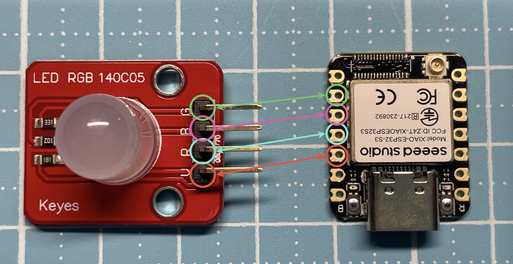

# ESP32-S3 MicroPython 入門教學 — KEYES 140C05 共陽極 RGB LED

這一章示範如何在 **Seeed XIAO ESP32-S3** 上，用 **MicroPython 控制 KEYES 140C05 RGB 全彩 LED（共陽極）** 顯示基本色光。

👉 **線上教學頁（GitHub Pages）**  
https://easyway0301.github.io/Seeed%20Xiao%20Esp32S3%20With%20MicroPython/B01-Keyes%20LED%20RGB%20140C05/sop.html

---

## 🧩 認識 RGB 共陽極 LED

本教學使用 KEYES 140C05 RGB LED 模組，這是一顆 **共陽極 (Common Anode)** 的全彩 RGB LED。  
共陽極 LED 的控制要點如下：

- 🔌 正極共用（接到 VCC）
- 🔴 GPIO 設為 `0` → LED 亮
- 🔴 GPIO 設為 `1` → LED 關

### 腳位設定

| 顏色 | ESP32-S3 GPIO |
|------|----------------|
| 紅色 | GPIO 9 |
| 藍色 | GPIO 8 |
| 綠色 | GPIO 7 |



### 引腳示意圖（參考）


> 圖片來源：Seeed Studio 官方文件 :contentReference[oaicite:0]{index=0}

---

## 🔧 MicroPython 控制範例

以下範例程式會依序顯示 **紅 → 綠 → 藍**，  
每個顏色亮起 1 秒，再熄滅 0.5 秒：

```python
import machine, time

# 科易 KEYES LED 140C05 RGB 全彩 LED（共陽極）

# 共陽極 RGB LED 腳位
red = machine.Pin(9, machine.Pin.OUT)
blue = machine.Pin(8, machine.Pin.OUT)
green = machine.Pin(7, machine.Pin.OUT)

# 全部關燈（共陽極：1 = 關）
red.value(1)
green.value(1)
blue.value(1)

# 顏色清單（0 = 亮）
colors = [
    (0, 1, 1),  # 紅
    (1, 0, 1),  # 綠
    (1, 1, 0),  # 藍
]

for r, g, b in colors:
    red.value(r)
    green.value(g)
    blue.value(b)
    time.sleep(1)

    # 關燈
    red.value(1)
    green.value(1)
    blue.value(1)
    time.sleep(0.5)

print("結束了")
